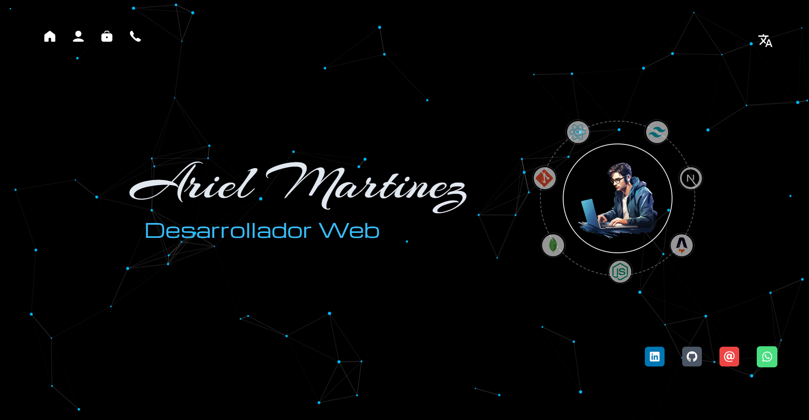

# Portfolio 2024 | Ariel Martinez



Este es mi portfolio personal desarrollado con [Next.js](https://nextjs.org/). Incluye una variedad de proyectos realizados, información de contacto y una sección sobre mí, donde se encuentra el link a mi CV online. Se encuentra disponible en inglés y español.

## <span style="display: inline-block; width: 10px; height: 10px; background-color: white; border-radius: 50%; margin-right: 5px;"></span> Deploy

[https://portfolio.empren.dev](https://portfolio.empren.dev)

## <span style="display: inline-block; width: 10px; height: 10px; background-color: white; border-radius: 50%; margin-right: 5px;"></span> Instrucciones para ejecutar localmente

1. Clona el repositorio:
    ```bash
    git clone https://github.com/Arielstereo/Portfolio2024.git
    ```

2. Navega al directorio del proyecto:
    ```bash
    cd portfolio2024
    ```

3. Instala las dependencias:
    ```bash
    npm install
    ```

4. Crea un archivo [.env.local](http://_vscodecontentref_/1) en la raíz del proyecto y agrega tus variables de entorno necesarias, por ejemplo:
    ```env
    RESEND_API_KEY=tu_api_key
    ```

5. Ejecuta el servidor de desarrollo:
    ```bash
    npm run dev
    ```

6. Abre [http://localhost:3000](http://localhost:3000) en tu navegador para ver el resultado.